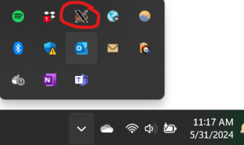
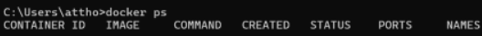
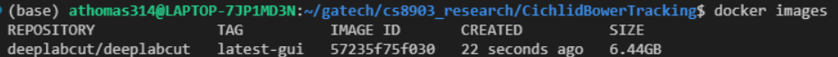
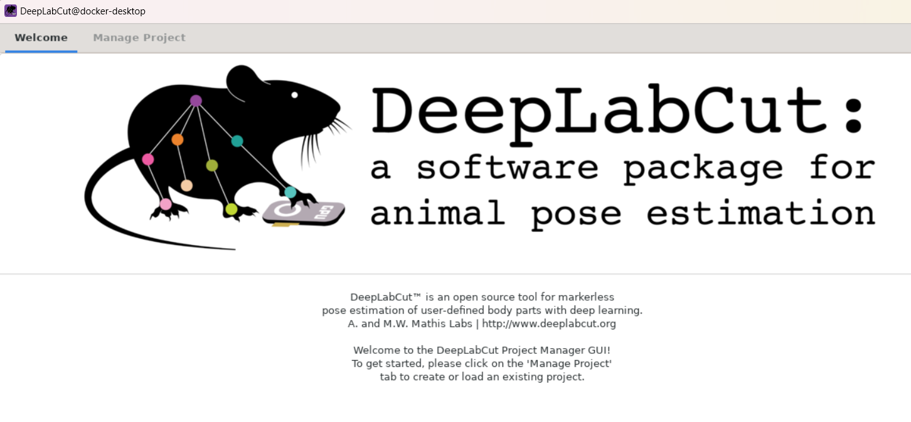
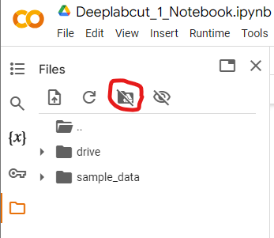
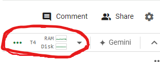

## README - Deeplabcut setup for Cichlid Bower Repository

### Dockerfile & docker-compose.yml
These files  are for local setup to setup a docker container 
and run the deeplabcut GUI for dataset curation and generation of a training set.
Follow the setup doc here: [deeplabcut gui docker container setup](#dlc-docker-setup)

### Deeplabcut_1_Notebook.ipynb
This file can be run in google colab to train a model. Simply follow the instructions
in the [deeplabcut google colab walkthrough](#google-colab-walkthrough)
 

### DLC docker setup (GUI Only)
1. Install [VcXsrv](https://sourceforge.net/projects/vcxsrv/)
    - This is an application that acts as a server and will launch GUI apps.
	- You can use other applications like Xming, MobaXterm, etc. 
	Use the link to download, install, and run the application using the default options.
	- To use VcXsrv, run the XLaunch application (you can find it by searching XLaunch
	in the Windows Search Bar) and you will be prompted with a window asking you 
	to configure various settings before launching the X Server.
	- Keep clicking **Next** to accept all the defaults and click **Finish** once it shows up.
2. You should now have an X-server running which should be visible in your taskbar 
    - 
3. If you don't have docker desktop installed, download it [here]( https://www.docker.com/products/docker-desktop/)
4. Open up a terminal
5. execute `docker ps`, output should look similar to this if docker has been installed properly
	- 
6. Check if the docker-compose.yml and Dockerfiles located in this repository need updates
    - see comments to understand what each line means, it is possible this will run out of the box
7.  `cd` to the directory containing your Dockerfile and docker-compose.yaml
8. Build the image specified in the compose with `docker-compose build`
9. execute `docker images` to see available images
	- results should look similar to this 
10. execute `docker-compose up` to launch the GUI
	- 
11. Follow instructions [here](https://deeplabcut.github.io/DeepLabCut/docs/maDLC_UserGuide.html) 
    to set up a project and begin labelling fish
 
### Google Colab Walkthrough
Once you have labelled your dataset and generated a training dataset following the DLC 
instructions you're ready to begin training models, you can do this locally if you have
a GPU, but if you do not a simple way to get access to a GPU is to use Google Colab. 
The steps below walk through how to train a DLC model on google colab.
 
1. Copy DLC project to google drive
2. Open google colab and mount your drive
	- 
3. Edit the project_path field in the config.yaml file to your new project location 
   in google drive
	- ex. /content/drive/My Drive/Research/<project_name>
4. edit the project path field in dlc-models/iteration-0/<project_name>/train/pose_cfg.yaml
	- you may also have to update the init_weights field depending on whether you are
	using the same version of python between your local setup that generated this file
	and google colab. I had to update it from python3.8 to python3.10
5. To run on a GPU, select the desired runtime in the top right corner of the colab notebook
	- 
6. run the Google colab notebook 
7. Expect quite long runtimes (many hours)

### Setting up DLC on SRG Computer
1. get access by emailing support@cos.gatech.edu and state that you are working with the McGrath Lab and need to be added to the McGrath lab group.
2. once you get access you can ssh into the computer via your `<gt-username>@srg.biology.gatech.edu`
	- login with your gatech.edu password
3. once logged in execute the following commands to install miniconda 
	- NOTE: this can be skipped if your terminal looks like `(base) [<gt_username>@biocomputesrg]`, the `(base)` means that conda is already installed
	- `wget https://repo.anaconda.com/miniconda/Miniconda3-latest-Linux-x86_64.sh`
	- `bash Miniconda3-latest-Linux-x86_64.sh`
	- press enter a bunch of times then enter 'yes'
	- `source ~/.bashrc`
4. cd into this folder (CichlidBowerTracking/cichlid_bower_tracking/deeplabcut_setup)
5. conda env create -f DEEPLABCUT.yaml
6. conda install -c conda-forge cudnn
7. find the path to your conda environment
	- if you installed miniconda @ your root it should be something like "/data/home/<username>/miniconda3/envs/DEEPLABCUT"
8. execute: `nano ~/.bashrc`
9. add the following line to the ~/.bashrc file 
	- export PATH=/data/home/<username>/miniconda3/envs/DEEPLABCUT/bin:$PATH
10. Ctrl+O to save the ~/.bashrc file, Ctrl+X to exit
11. execute: ``source ~/.bashrc`
12. to check if you have deeplabcut properly installed
	- open a python terminal by typing `python` and pressing enter
	- in the python terminal `import deeplabcut`
	- it will give some warnings, but it should say 'DLC loaded in light mode; you cannot use any GUI...' with no error messages after
	- now you can train a model!